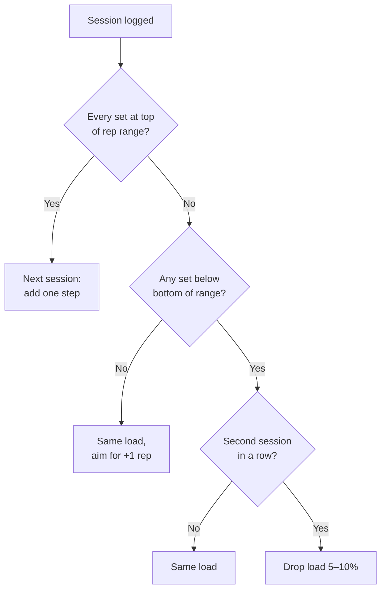
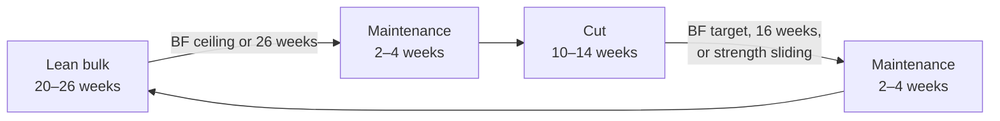

# Training & Bulk/Cut Plan: Findings and Applet Spec

Sep 24, 2026 · @Scrimblo

## How to use this document

This doc turns the review of your 5-day split into a training plan, nutrition targets and an applet build spec. Hand it all to Claude Code: the Applet specification section is the build brief, and earlier sections hold the rules and data.

- **Units:** pounds (lb) for loads and bodyweight, kcal for energy, grams for macros. Formulas that need metric inputs say so.
- **Tags:** **\[Evidence\]** marks a rule backed by the studies in Evidence and sources. **\[Heuristic\]** marks a practical default chosen for the applet; make it user-editable.
- **Starting loads:** your spreadsheet weights are treated as current working weights, since you update those cells as you progress.

## Profile and baseline

You're 22, male, 163 lb at 5'11", with about 140 lb of lean mass and 23 lb of fat. Your FFMI is about 19.5, well below the \~25 often cited as the drug-free ceiling, so there's lots of room to grow.

| Metric | Value | Source |
| --- | --- | --- |
| Age | 22 | You |
| Sex | Male | You |
| Height | 5'11" (71 in, 180.3 cm) | You |
| Bodyweight | 163 lb (73.9 kg) | You |
| Body fat | 14.3% | Smart scale |
| Fat mass | 23.3 lb (10.6 kg) | Weight × body fat % |
| Lean body mass | 139.7 lb (63.4 kg) | Weight − fat mass |
| Scale "muscle mass" | 132 lb | Smart scale |
| Skeletal muscle | 55.3% | Smart scale |
| Subcutaneous fat | 12.7% | Smart scale |
| Visceral fat rating | 5 | Smart scale |
| BMI | 22.7 | 703 × lb ÷ in² |
| FFMI | 19.5 kg/m² | Lean mass (kg) ÷ height (m)² |
| Training level | Intermediate | Your loads: 315 lb deadlift × 8, +50 lb chin-ups × 6 |

How the applet should treat the scale fields:

- **Lean mass:** derive it from weight and body fat %. The scale's 132 lb "muscle mass" likely excludes its bone estimate (139.7 − 132 ≈ 7.7 lb), and brands define it differently. **\[Heuristic\]**
- **Skeletal muscle %, subcutaneous fat %, visceral rating:** store them for trends only; no calculation uses them. A visceral rating of 5 sits in the normal band on common consumer scales.
- **Accuracy:** consumer bioimpedance scales can miss true body fat by several points and shift with hydration. Weigh under the same conditions and trust multi-week trends over single readings.

## Key findings

Your split works, but volume is lopsided: arms and chest are each crammed into one day, and quads get just 5 sets a week. A Push/Pull/Legs + Upper/Lower week fixes this, trains each muscle about twice, and keeps nearly all your exercises.

| Topic | What the evidence says | How this plan applies it |
| --- | --- | --- |
| Frequency | With weekly volume equal, 1× vs. 2× a week barely changes growth; strength improves with more frequent practice | Each muscle about 2× a week |
| Weekly volume | More weekly sets means more growth, with diminishing returns; trained lifters do well on \~10–20 hard sets per muscle | 10–20 fractional sets per muscle |
| Per-session volume | Past \~11 fractional sets for one muscle in a session, extra sets added no detectable growth (preprint) | At most 11 hard sets per muscle per session |
| Effort | Growth rises as sets end closer to failure; true failure isn't required | 1–3 reps in reserve (RIR) on compounds, 0–1 on isolations |
| Load and reps | Loads from \~30% of 1RM upward build muscle if sets are hard | 5–12 reps on compounds, 10–20 on isolations |
| Rest | Resting longer than 60 s helps slightly; little difference beyond \~90 s | 90 s on isolations, 2–3 min on compounds |
| Muscle length | Training at long muscle lengths helped in several studies: seated beat prone leg curls, overhead beat pushdowns for triceps | Keep seated curls and overhead extensions; control the stretch |
| Progression | Adding reps or adding load both drive gains | Double progression, which you already do by hand |

### Current vs. revised direct sets per week

A set counts toward the muscle it mainly trains; deadlift sets count toward hamstrings. Volume accounting adds partial credit for assisting muscles.

| Muscle | Current plan | Revised plan |
| --- | --- | --- |
| Quads | 5 | 12 |
| Hamstrings | 6 | 9 |
| Glutes | 3 | 5 |
| Side delts | 3 | 7 |
| Chest | 13 (all one day) | 13 (8 + 5) |
| Triceps | 12 (all one day) | 10 (5 + 5) |
| Biceps | 9 | 8 |
| Back (lats, mid-back) | 11 | 11 |
| Rear delts | 8 | 5 |
| Calves | 4 | 6 |
| Abs | 3 | 5 |
| Total working sets | 84 | 94 |

Other changes:

- **Day order:** arm day no longer comes right before chest day, and deadlifts no longer fall the day before squats.
- **Dropped:** landmine press, deficit push-ups, shrug ladder and Y-W raises. Add the shrug or Y-W back as finishers if time allows.
- **History:** you already progress by updating the sheet; the applet should store every session so trends stay visible.

## Training program

Train five days in this order: Mon Lower A, Tue Push, Wed Pull, Thu off, Fri Lower B, Sat Upper, Sun off. Starting loads are your current sheet weights; "Set in week 1" means find a load that fits the rep range and RIR.

RIR is reps in reserve at the end of a set. Step is the load added once every set reaches the top of its range.

### Lower A (Mon): quad focus

| # | Exercise | Sets × reps | RIR | Rest | Start load (lb) | Step (lb) |
| --- | --- | --- | --- | --- | --- | --- |
| 1 | Smith machine squat | 4 × 6–10 | 1–2 | 2–3 min | 220 | 10 |
| 2 | Leg extension | 3 × 10–15 | 0–1 | 90 s | 170 | 5 |
| 3 | Seated leg curl | 3 × 10–15 | 0–1 | 90 s | 95 | 5 |
| 4 | Hip thrust | 2 × 8–12 | 1–2 | 2 min | 200 | 10 |
| 5 | Standing calf raise | 3 × 10–15 | 0–1 | 90 s | 350 | 10 |
| 6 | Cable crunch | 3 × 10–15 | 0–1 | 90 s | 160 | 5 |

### Push (Tue)

| # | Exercise | Sets × reps | RIR | Rest | Start load (lb) | Step (lb) |
| --- | --- | --- | --- | --- | --- | --- |
| 1 | Incline DB bench press | 3 × 6–10 | 1–2 | 2–3 min | 70 per hand | 5 |
| 2 | Flat machine or DB press (new) | 3 × 8–12 | 1–2 | 2 min | Set in week 1 | 5 |
| 3 | Machine fly | 2 × 10–15 | 0–1 | 90 s | 205 | 5 |
| 4 | Overhead shoulder press | 3 × 6–10 | 1–2 | 2–3 min | 170 | 5 |
| 5 | Lateral raise (machine) | 3 × 10–20 | 0–1 | 90 s | 40 | 2.5 |
| 6 | Single-arm overhead cable triceps extension | 3 × 10–15 | 0–1 | 90 s | 30 | 2.5 |
| 7 | Dip machine | 2 × 8–12 | 1–2 | 2 min | 200 | 10 |

### Pull (Wed)

| # | Exercise | Sets × reps | RIR | Rest | Start load (lb) | Step (lb) |
| --- | --- | --- | --- | --- | --- | --- |
| 1 | Weighted chin-up | 3 × 6–8 | 1–2 | 2–3 min | +50 added | 5 |
| 2 | Machine barbell row | 3 × 8–12 | 1–2 | 2 min | 170 | 10 |
| 3 | Rocking pulldown | 2 × 10–12 | 1–2 | 2 min | 165 | 5 |
| 4 | Rear delt fly | 3 × 12–20 | 0–1 | 90 s | 120 | 5 |
| 5 | Face pull | 2 × 12–15 | 0–1 | 90 s | 120 | 5 |
| 6 | Preacher curl | 3 × 8–12 | 0–1 | 90 s | 80 | 5 |
| 7 | DB hammer curl | 2 × 10–12 | 0–1 | 90 s | 45 per hand | 5 |

### Lower B (Fri): posterior chain

| # | Exercise | Sets × reps | RIR | Rest | Start load (lb) | Step (lb) |
| --- | --- | --- | --- | --- | --- | --- |
| 1 | Deadlift (or Romanian deadlift) | 3 × 5–8 | 2–3 | 3 min | 315 | 10 |
| 2 | Bulgarian split squat or leg press (new) | 3 × 8–12 | 1–2 | 2 min | Set in week 1 | 5–10 |
| 3 | Seated leg curl | 3 × 10–15 | 0–1 | 90 s | 95 | 5 |
| 4 | Hip thrust | 3 × 8–12 | 1–2 | 2 min | 200 | 10 |
| 5 | Leg extension | 2 × 12–15 | 0–1 | 90 s | 170 | 5 |
| 6 | Standing calf raise | 3 × 10–15 | 0–1 | 90 s | 350 | 10 |
| 7 | Cable crunch | 2 × 10–15 | 0–1 | 90 s | 160 | 5 |

### Upper (Sat): chest, back, delts, arms

| # | Exercise | Sets × reps | RIR | Rest | Start load (lb) | Step (lb) |
| --- | --- | --- | --- | --- | --- | --- |
| 1 | Incline cable press | 3 × 8–12 | 1–2 | 2 min | 53 | 5 |
| 2 | Cable crossover | 2 × 10–15 | 0–1 | 90 s | 60 | 5 |
| 3 | Machine row (upper) | 3 × 8–12 | 1–2 | 2 min | 160 | 5 |
| 4 | Lateral raise (machine) | 4 × 10–20 | 0–1 | 90 s | 40 | 2.5 |
| 5 | Incline DB biceps curl (machine) | 3 × 10–15 | 0–1 | 90 s | 40 | 2.5 |
| 6 | Straight-bar triceps pushdown | 3 × 10–15 | 0–1 | 90 s | 130 | 5 |
| 7 | Machine triceps extension | 2 × 12–15 | 0–1 | 90 s | 75 | 5 |

Notes:

- **Changed rep ranges:** start lighter on machine fly, lateral raise, rear delt fly and face pull (higher reps now). Start heavier on dip machine and deadlift (lower reps now).
- **Effort and rest:** the RIR and rest ranges follow the evidence; the exact value per exercise is a **\[Heuristic\]**.
- **Machines:** if a machine's smallest stack jump differs from the step shown, use the machine's jump.
- **Stretch:** control the deepest position on leg extensions, flyes, curls and overhead extensions. A few partial reps in the stretched position after the last full rep are optional. **\[Evidence, modest\]**
- **Optional finishers:** barbell shrug ladder, hyper Y-W combo.

## Volume accounting

The applet counts weekly sets per muscle with fractional credit: 1.0 for the muscle an exercise mainly trains, 0.5 for a muscle that assists. Pelland et al. found this fractional count fit the research data best. **\[Evidence\]**

```latex
\text{weekly sets}_m = \sum_{e} \text{sets}_e \times w_{e,m}, \qquad w_{e,m} \in \{1.0,\ 0.5,\ 0\}
```

| Exercise | Weight 1.0 | Weight 0.5 |
| --- | --- | --- |
| Smith machine squat | Quads | Glutes |
| Bulgarian split squat or leg press | Quads | Glutes |
| Leg extension | Quads |  |
| Deadlift or Romanian deadlift | Hamstrings | Glutes, quads |
| Seated leg curl | Hamstrings |  |
| Hip thrust | Glutes |  |
| Standing calf raise | Calves |  |
| Cable crunch | Abs |  |
| Incline DB bench press | Chest | Front delts, triceps |
| Flat machine or DB press | Chest | Front delts, triceps |
| Incline cable press | Chest | Front delts, triceps |
| Machine fly | Chest |  |
| Cable crossover | Chest |  |
| Overhead shoulder press | Front delts | Side delts, triceps |
| Lateral raise (machine) | Side delts |  |
| Dip machine | Triceps | Chest, front delts |
| Single-arm overhead cable triceps extension | Triceps |  |
| Straight-bar triceps pushdown | Triceps |  |
| Machine triceps extension | Triceps |  |
| Weighted chin-up | Back | Biceps |
| Rocking pulldown | Back | Biceps |
| Machine barbell row | Back | Biceps, rear delts |
| Machine row (upper) | Back | Biceps, rear delts |
| Rear delt fly | Rear delts |  |
| Face pull | Rear delts |  |
| Preacher curl | Biceps |  |
| Incline DB biceps curl (machine) | Biceps |  |
| DB hammer curl | Biceps |  |

### Weekly totals for the revised plan

| Muscle | Sets at 1.0 | Fractional total | Status vs. 10–20 band |
| --- | --- | --- | --- |
| Triceps | 10 | 16 | In range |
| Chest | 13 | 14 | In range |
| Quads | 12 | 13.5 | In range |
| Biceps | 8 | 13.5 | In range |
| Back | 11 | 11 | In range |
| Glutes | 5 | 10 | In range |
| Hamstrings | 9 | 9 | Just under; add a leg-curl set if they lag |
| Side delts | 7 | 8.5 | Just under; add a lateral-raise set if they lag |
| Front delts | 3 | 8.5 | Enough; pressing covers them |
| Rear delts | 5 | 8 | Just under; add a set if they lag |
| Calves | 6 | 6 | Low by choice; raise if a priority |
| Abs | 5 | 5 | Low by choice; raise if a priority |

Flags for the applet: under 10 fractional sets a week is "low", over 20 is "high", and over 11 for one muscle in one session is "over session cap". **\[Heuristic, set from the evidence ranges\]**

## Progression rules

Keep progressing as you do now, but let the applet log every session instead of overwriting cells. It applies double progression: add reps within the range, then add one step of load once every set reaches the top. **\[Evidence: Plotkin 2022; exact thresholds are Heuristic\]**



The applet runs this check per exercise after each session and pre-fills the next session with the suggested load.

Estimated one-rep max (Epley) tracks strength across rep ranges. Use each session's best set.

```latex
\text{e1RM} = \text{load} \times \left(1 + \frac{\text{reps}}{30}\right)
```

- **Weighted chin-ups:** put bodyweight + added load into the formula, then subtract bodyweight for display.
- **High-rep sets:** e1RM is least reliable above \~12 reps; for those, track reps at a given load instead.
- **Stall:** no e1RM (or reps-at-load) gain in 3 straight sessions of an exercise. Suggest checking sleep and calories, then a close variation or one fewer set for 2 weeks. **\[Heuristic\]**
- **Deload:** if several lifts stall at once or joints ache, suggest a week at about half the sets and \~10% lighter loads. Evidence on scheduled deloads for growth is limited, so trigger them from data, not the calendar. **\[Heuristic\]**
- **Logging:** record load, reps and RIR (0–5) for every set, plus an optional note. Never overwrite a past session.

## Nutrition targets

Start with a lean bulk at about 3,000 kcal/day, aiming to gain about 0.5 lb a week. At \~14% body fat with plenty of room to add muscle, there's no need to cut first.

### Maintenance estimate

Your estimated maintenance is about 2,700 kcal/day, likely between 2,600 and 2,900. The applet replaces this with a measured value after 2–3 weeks of logging.

```latex
\text{Katch-McArdle RMR} = 370 + 21.6 \times \text{lean mass (kg)} = 370 + 21.6 \times 63.4 \approx 1739\ \text{kcal}
```

```latex
\text{Mifflin-St Jeor RMR (male)} = 10W + 6.25H - 5A + 5 \approx 1762\ \text{kcal}
```

W is weight in kg, H is height in cm, and A is age in years. Multiply the average of the two by an activity factor of 1.55 for five lifting days and a moderately active routine: 1,750 × 1.55 ≈ 2,715 kcal. **\[Heuristic\]**

### Targets by phase

| Target | Lean bulk | Maintenance | Cut |
| --- | --- | --- | --- |
| Calories (kcal/day) | \~3,000 | \~2,700 | \~2,200 |
| Change vs. maintenance | +10–15% (about +300) | 0 | About −500 |
| Rate (% bodyweight/week) | +0.25 to +0.5 (0.4–0.8 lb) | Within ±0.25 | −0.5 to −0.75 (0.8–1.2 lb) |
| Protein (g/day) | 150 (range 120–165) | 150 | 170 (range 145–195) |
| Fat (g/day) | 83 (25% of kcal) | 75 (25%) | 61 (25%) |
| Carbs (g/day) | \~410 | \~355 | \~240 |

```latex
\text{fat (g)} = \frac{\text{kcal} \times \text{fat share}}{9}, \qquad \text{carbs (g)} = \frac{\text{kcal} - 4 \times \text{protein (g)} - 9 \times \text{fat (g)}}{4}
```

- **Bulk surplus and rate:** +10–20% over maintenance and 0.25–0.5% bodyweight a week suit novices and intermediates (Iraki 2019). In trained lifters, a larger surplus added more fat without a clear muscle advantage (Helms 2023). **\[Evidence\]**
- **Cut rate:** 0.5–1% bodyweight a week preserves muscle better than faster loss, and leaner lifters should stay near the low end (Helms 2014, Garthe 2011). Larger deficits increasingly blunt lean-mass gains; about 500 kcal/day was enough to erase them (Murphy & Koehler 2022). **\[Evidence\]**
- **Protein:** muscle gains plateau near 1.6 g/kg, with an upper bound near 2.2 g/kg (Morton 2018). On a cut, use 2.3–3.1 g per kg of lean mass (Helms 2014). **\[Evidence\]**
- **Fat:** 20–30% of calories on a bulk and 15–30% on a cut, defaulting to 25%. Carbs fill the rest. **\[Evidence\]**
- **Meals:** spread protein over 4 or more meals of about 30–40 g each. **\[Evidence\]**

### Phase plan



At 0.5 lb a week, a 20–26 week bulk adds about 10–13 lb; a 10–14 week cut at \~1 lb a week removes about 10–14 lb. How gained weight splits between muscle and fat varies a lot between people.

- **End the bulk** when your 7-day average scale body fat reaches your ceiling (default 18%), at 26 weeks, or when you choose. **\[Heuristic\]**
- **End the cut** at your body-fat target (default 12%), at 16 weeks, or if main-lift e1RMs fall more than \~5% over 3 weeks. **\[Heuristic\]**
- **Thresholds are preferences:** evidence for body-fat cut-offs and "bulk only when lean" claims is weak.
- **Diet breaks (optional):** a week at maintenance every 3–4 weeks of cutting. In trained lifters this didn't improve fat loss or muscle retention but did ease hunger (Peos 2021). **\[Evidence\]**
- **Recalculate** each phase's targets from current trend weight and measured maintenance when the phase starts.

## Tracking and adjustment

Weigh in daily, smooth the readings into a trend, and change calories only when the trend misses its band two weeks running. Adjust in 100–150 kcal steps.

- **Weigh-ins:** every morning after the bathroom, before food or drink, on the same scale. **\[Heuristic\]**
- **Body composition:** log scale readings weekly under the same conditions and use them for trends only.
- **Intake:** log daily kcal, protein, carbs and fat, and optionally steps.

Trend weight is an exponential moving average with α = 0.1, the Hacker's Diet method; also show the 7-day average. **\[Heuristic\]**

```latex
T_t = T_{t-1} + 0.1\,(W_t - T_{t-1}), \qquad \text{rate (\% bodyweight/week)} = \frac{T_t - T_{t-7}}{T_{t-7}} \times 100
```

Measured maintenance (TDEE) comes from intake and trend change over the last 14–21 days, at \~3,500 kcal per lb of trend change:

```latex
\text{TDEE} = \overline{\text{kcal/day}} - \frac{3500 \times (T_{\text{end}} - T_{\text{start}})}{\text{days}}
```

Require at least 80% of days logged, and cap each weekly update at ±150 kcal so noise doesn't swing targets. **\[Heuristic\]**

### Weekly check-in rules

| Phase | Trend rate, two weeks running | Suggested action |
| --- | --- | --- |
| Any | First week of a new phase | No change (water and glycogen shift) |
| Lean bulk | Below +0.25% bodyweight/week | +100–150 kcal |
| Lean bulk | Above +0.5% bodyweight/week | −100–150 kcal |
| Maintenance | Outside ±0.25% bodyweight/week | 100 kcal back toward zero change |
| Cut | Slower than −0.5% bodyweight/week | −100–150 kcal, or \~2,000 more steps a day |
| Cut | Faster than −0.75% bodyweight/week | +100–150 kcal |

### Logging accuracy

- **Weigh food** in grams, raw where possible, and log oils, sauces and drinks.
- **Prefer verified database entries** over user-submitted ones.
- **Expect label error:** US rules let packaged food run up to 20% over its label, and restaurant meals averaged 18% more calories than stated in one study (Urban 2010). The weight trend corrects for this over time. **\[Evidence\]**

## Training adjustments by phase

Keep loads and effort the same in every phase and change only volume. A cut isn't the time to switch to light weights and high reps.

| Phase | Volume | Loads and effort |
| --- | --- | --- |
| Lean bulk | Add 1 set to a lagging muscle every 3–4 weeks, up to \~20 fractional sets **\[Heuristic\]** | Same RIR targets; push progression |
| Maintenance | Keep current volume | Same; a good time to try new exercises |
| Cut | Keep volume; if recovery suffers, drop up to a third of sets | Keep loads and RIR |

In trained men who were dieting, 3 vs. 5 sets per exercise preserved lean mass equally (Roth 2023). Strength gains held up in an energy deficit even when lean-mass gains didn't (Murphy & Koehler 2022). **\[Evidence\]**

## Applet specification for Claude Code

Build a single-user tracker that logs workouts, bodyweight and nutrition, applies every rule in this doc, and never overwrites history. Platform and tech stack are open; data must persist locally and export to CSV.

### Features (v1)

1. **Workout logger:** pick today's program day; exercises arrive pre-filled with suggested loads. Log load, reps and RIR per set, with a rest timer using each exercise's rest value.
2. **Progression engine:** apply Progression rules after each session and show e1RM trends, stall flags and deload suggestions.
3. **Volume dashboard:** weekly fractional sets per muscle against the 10–20 band, plus a warning when one session exceeds 11 for a muscle.
4. **Body log:** daily weight and weekly scale fields, charted as trend weight and 7-day average.
5. **Nutrition:** phase setup (type, start date, rate band), daily kcal and macro targets, and daily intake totals. A food database is out of scope for v1.
6. **Weekly check-in:** trend rate vs. band, measured maintenance, and a suggested calorie change to accept or skip, plus phase-switch prompts.
7. **Program editor:** edit exercises, sets, rep ranges, RIR, rest, step size and muscle weights.
8. **Export:** CSV files for sets, body entries and nutrition entries.

### Data model

| Entity | Fields |
| --- | --- |
| UserProfile | name, sex, age, heightIn, units (lb or kg), activityFactor |
| BodyEntry | date, weightLb, bodyFatPct?, muscleMassLb?, skeletalMusclePct?, subcutFatPct?, visceralRating? |
| Exercise | id, name, repMin, repMax, rirMin, rirMax, restSec, stepLb, loadType (barbell, dumbbell, machine, cable, bodyweight-plus), muscleWeights {muscle: 1.0 or 0.5} |
| ProgramDay | id, name, weekday, items \[{exerciseId, sets}\] |
| Session | id, date, programDayId, bodyweightLb |
| SetLog | id, sessionId, exerciseId, setIndex, loadLb, reps, rir, note? |
| NutritionEntry | date, kcal, proteinG, carbsG, fatG, steps? |
| Phase | id, type (bulk, maintenance, cut), startDate, endDate?, rateMinPct, rateMaxPct, kcalTarget, proteinG, fatPct, bfCeilingPct?, bfTargetPct? |
| CheckIn | weekStart, trendRatePct, tdeeEstimate, suggestedKcalChange, accepted |

Seed data: program days and exercises from Training program, muscle weights from Volume accounting, and the profile plus first BodyEntry from Profile and baseline.

### Default settings

| Setting | Default | Tag |
| --- | --- | --- |
| Activity factor | 1.55 | Heuristic |
| Trend smoothing α | 0.1 | Heuristic |
| Energy per lb of trend change | 3,500 kcal | Heuristic |
| Maintenance window | 14–21 days, at least 80% logged | Heuristic |
| Max weekly target change | ±150 kcal | Heuristic |
| Bulk rate band | +0.25 to +0.5% bodyweight/week | Evidence |
| Cut rate band | −0.5 to −0.75% bodyweight/week | Evidence |
| Maintenance band | ±0.25% bodyweight/week | Heuristic |
| Bulk protein | 2.0 g/kg bodyweight | Evidence |
| Cut protein | 2.7 g/kg lean mass | Evidence |
| Fat share | 25% of kcal | Evidence |
| Weekly volume band | 10–20 fractional sets per muscle | Evidence |
| Session cap | 11 fractional sets per muscle | Evidence (preprint) |
| Stall window | 3 sessions | Heuristic |
| Miss rule | 2 sessions below range, then 5–10% less load | Heuristic |
| Bulk body-fat ceiling | 18% | Heuristic |
| Cut body-fat target | 12% | Heuristic |
| Max bulk / cut length | 26 / 16 weeks | Heuristic |

### Acceptance criteria

- [ ] Logging a session never changes a past session's data.
- [ ] Suggested loads follow the Progression rules flowchart exactly, including the two-session miss rule.
- [ ] With the seed program, weekly fractional sets match Volume accounting (quads 13.5, chest 14, triceps 16).
- [ ] With the seed profile, starting targets match Nutrition targets (about 2,700 kcal maintenance, 3,000 kcal bulk, 150 g protein).
- [ ] The check-in suggests no calorie change in the first week of a phase.
- [ ] Every setting tagged Heuristic is editable.
- [ ] Switching between lb and kg changes displayed values only, never stored data.
- [ ] CSV export includes every set with date, exercise, load, reps and RIR.

## Evidence and sources

Most rules rest on meta-analyses of trained adults. Lower-confidence items are marked so the applet can treat them as editable defaults.

| Study | Topic | Finding used here | Confidence |
| --- | --- | --- | --- |
| [Pelland et al. 2025, Sports Medicine](https://link.springer.com/article/10.1007/s40279-025-02344-w) | Volume and frequency | Weekly volume grows muscle with diminishing returns; frequency matters for strength, barely for size; fractional counting fits best | High |
| [Schoenfeld et al. 2019](https://www.bisp-surf.de/Record/PU201906004485) | Frequency | With volume equated, frequency doesn't meaningfully change growth | High |
| Schoenfeld et al. 2016 | Frequency | 2× a week beat 1× a week when volume wasn't equated | Moderate |
| [Schoenfeld et al. 2017](https://www.ageingmuscle.be/sites/bams/files/publications/Dose%20response%20relationship%20between%20weekly%20resistance%20training%20volume%20and%20increases.pdf) | Weekly volume | Growth rises with weekly sets; 10+ sets a week did best | High |
| [Baz-Valle et al. 2022](https://jhk.termedia.pl/A-Systematic-Review-of-the-Effects-of-Different-Resistance-Training-Volumes-on-Muscle,158681,0,2.html) | Weekly volume | \~12–20 sets a week suits trained lifters | Moderate |
| [Remmert et al. 2025 (preprint)](https://sportrxiv.org/index.php/server/preprint/view/537) | Per-session volume | No detectable extra growth past \~11 fractional sets per session | Low |
| [Refalo et al. 2023](https://d-nb.info/127876321X/34) | Effort | Training to failure isn't better than stopping near it | High |
| [Robinson et al. 2024](https://www.semanticscholar.org/paper/Exploring-the-Dose%E2%80%93Response-Relationship-Between-to-Robinson-Pelland/21e9295d1d3c1f07fe73d9d9796410ecae4a508f) | Effort | Growth increases as sets end closer to failure | High |
| [Schoenfeld et al. 2021](https://www.mdpi.com/2075-4663/9/2/32) | Loading | Loads from \~30% of 1RM build muscle when sets are hard | Moderate |
| [Singer et al. 2024](https://www.frontiersin.org/journals/sports-and-active-living/articles/10.3389/fspor.2024.1429789/full) | Rest | Rest over 60 s helps slightly; little gain past 90 s | Moderate |
| [Maeo et al. 2021](https://www.researchgate.net/publication/344445943_Greater_Hamstrings_Muscle_Hypertrophy_but_Similar_Damage_Protection_after_Training_at_Long_versus_Short_Muscle_Lengths) | Muscle length | Seated leg curls grew hamstrings more than prone curls | Moderate |
| [Maeo et al. 2023](https://www.tandfonline.com/doi/pdf/10.1080/17461391.2022.2100279) | Muscle length | Overhead extensions grew triceps more than pushdowns | Moderate |
| Pedrosa et al. 2022 | Muscle length | Lengthened partials beat full range for quads in untrained women | Low |
| [Lengthened partials in trained lifters, PeerJ 2025](https://peerj.com/articles/18904/) | Muscle length | Lengthened partials matched full range in trained lifters | Moderate |
| Plotkin et al. 2022 | Progression | Adding reps or adding load gave similar growth | Moderate |
| [Iraki et al. 2019](https://www.semanticscholar.org/paper/Nutrition-Recommendations-for-Bodybuilders-in-the-A-Iraki-Fitschen/5b34fee72e73b8f2d06510ba9f71aa37574caccc) | Bulking | +10–20% kcal and 0.25–0.5% bodyweight a week for novices and intermediates | Moderate |
| [Helms et al. 2023](https://link.springer.com/article/10.1186/s40798-023-00651-y) | Bulking | A larger surplus added more fat without clear extra muscle | Moderate |
| [Helms et al. 2014](https://www.ncbi.nlm.nih.gov/pmc/articles/PMC4033492/) | Cutting | 0.5–1% bodyweight a week; 2.3–3.1 g/kg lean mass of protein; fat 15–30% of kcal | Moderate |
| [Garthe et al. 2011](https://www.researchgate.net/publication/51113664_Effect_of_Two_Different_Weight-Loss_Rates_on_Body_Composition_and_Strength_and_Power-Related_Performance_in_Elite_Athletes) | Cutting | Losing 0.7% a week kept more lean mass than 1.4% a week | Moderate |
| [Murphy & Koehler 2022](https://onlinelibrary.wiley.com/doi/10.1111/sms.14075) | Cutting | Energy deficits blunt lean-mass gains but not strength gains | High |
| [Roth et al. 2023](https://onlinelibrary.wiley.com/doi/10.1111/sms.14237) | Cutting | 3 vs. 5 sets per exercise preserved lean mass equally | Moderate |
| [Morton et al. 2018](https://www.researchgate.net/publication/318368028_A_systematic_review_meta-analysis_and_meta-regression_of_the_effect_of_protein_supplementation_on_resistance_training-induced_gains_in_muscle_mass_and_strength_in_healthy_adults) | Protein | Gains plateau near 1.6 g/kg, upper bound near 2.2 | High |
| [Byrne et al. 2018 (MATADOR)](https://www.nature.com/articles/ijo2017206) | Diet breaks | 2-week breaks improved fat loss in men with obesity | Moderate |
| [Peos et al. 2021 (ICECAP)](https://www.ncbi.nlm.nih.gov/pmc/articles/PMC7906362/) | Diet breaks | In trained lifters, 1-week breaks didn't improve body composition but eased hunger | Moderate |
| Urban et al. 2010 | Food logging | Restaurant meals averaged 18% more kcal than stated | Moderate |

The RMR, Epley and trend-weight formulas are standard published equations. The FFMI ceiling of \~25 (Kouri et al. 1995) and the US 20% label tolerance (21 CFR 101.9) are cited from memory and approximate.

## Caveats

Treat every target here as a starting point; your own trend data should override it within a few weeks.

- **Scale error:** body fat from a consumer scale can be off by several points, and that error carries into lean mass, FFMI and cut protein.
- **Maintenance:** formula estimates often miss by a few hundred kcal, which is why the applet measures it.
- **Study populations:** most muscle-length studies used untrained people, and effects in trained lifters look smaller.
- **Preprint:** the \~11-set session cap comes from a preprint and may change.
- **Body-fat switch points:** these are preferences, not research-backed thresholds.
- **Safety:** this isn't medical advice. Swap or stop any exercise that causes pain.
